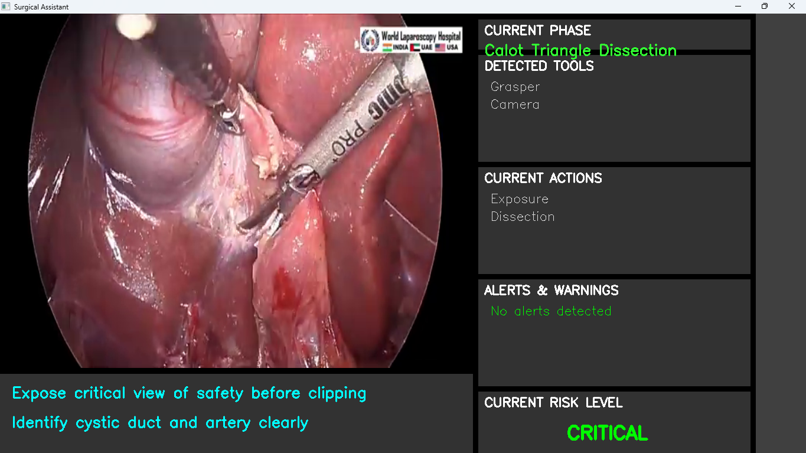

# SurgicalAI

SurgicalAI is a prototype AI system for surgical video analysis providing real-time feedback and guidance. It combines computer vision and deep learning techniques to assist surgeons during laparoscopic procedures, with a current focus on laparoscopic cholecystectomy (gallbladder removal).

## Project Status: Research Prototype

**IMPORTANT:** This system is a prototype that has undergone initial training and validation. While functional, it requires further clinical validation before consideration for real-world applications.

## Features

- **Surgical Phase Recognition**: Identifying surgical phases using Vision Transformer (ViT) with LSTM temporal processing
- **Surgical Tool Detection**: Detecting surgical instruments with Faster R-CNN and Feature Pyramid Networks
- **Mistake Detection**: Experimental identification of potential surgical mistakes and providing risk assessment
- **Guidance Generation**: Real-time guidance based on detected phases, tools, and potential mistakes
- **Web Interface**: User-friendly web application for video processing and visualization

## Technical Stack

- **Vision Models**: 
  - ViT-LSTM for phase recognition
  - Faster R-CNN for tool detection
  - Multi-modal fusion for mistake detection
- **NLP**: GPT-2 for guidance generation
- **Training Data**: Built using the Cholec80 dataset plus additional collected surgical videos
- **Frontend**: Flask-based web application

## System Interface



The system displays phase recognition, tool detection, and risk assessment in real-time. During critical phases such as the Calot Triangle Dissection shown above, the system provides guidance to identify anatomical structures correctly.

## Installation

### Prerequisites

- Python 3.8+
- PyTorch 1.8+
- CUDA-compatible GPU (recommended for real-time processing)

### Setup

1. Clone the repository:
   ```bash
   git clone https://github.com/YoussefAbdelmaksod1/SurgicalAI.git
   cd SurgicalAI
   ```

2. Create a virtual environment:
   ```bash
   python -m venv venv
   source venv/bin/activate  # On Windows: venv\Scripts\activate
   ```

3. Install dependencies:
   ```bash
   pip install -r requirements.txt
   ```

4. Download trained model weights (already included in the repository under models/weights/)

## Usage

### Running the Web Application (Under Development)

```bash
python app/main.py --mode web --host localhost --port 5000
```

This starts the web server at http://localhost:5000 where you can:
- Upload surgical videos for analysis
- View real-time analysis results
- Access visualizations of detected phases, tools, and potential mistakes

**Note:** While the models have been trained, this prototype is intended for research purposes and should not be used for clinical decision-making without proper medical supervision.

### Processing Videos via Command Line

You can also process videos directly from the command line:

```bash
python app/main.py --mode video --input path/to/surgery.mp4 --output results.mp4
```

## Project Structure

```
SurgicalAI/
├── app/                # Web application and interface
│   ├── main.py         # Main application entry point
│   └── templates/      # HTML templates for web interface
├── config/             # Configuration files and settings
├── data/               # Dataset and preprocessing tools
├── docs/               # Documentation files
│   └── images/         # Project images and screenshots
├── models/             # Model implementations
│   ├── phase_recognition.py  # Surgical phase recognition model
│   ├── tool_detection.py     # Surgical tool detection model
│   ├── mistake_detection.py  # Mistake detection model
│   ├── voice_assistant.py    # Voice guidance module
│   └── weights/        # Trained model weights
├── scripts/            # Utility scripts for data processing
├── tests/              # Unit and integration tests
├── training/           # Training implementations and scripts
├── utils/              # Shared utility functions
├── .gitignore          # Git ignore file
├── requirements.txt    # Python dependencies
└── setup.py            # Package installation setup
```

## Model Architecture Details

### Phase Recognition
- **Architecture**: Vision Transformer (ViT-B/16) with Bidirectional LSTM
- **Training Data**: Sequences of video frames with phase annotations
- **Output**: Classification of 7 surgical phases
- **Performance**: ~85% accuracy on validation set

### Tool Detection
- **Architecture**: Faster R-CNN with ResNet50 backbone
- **Training Data**: Annotated images with bounding boxes around surgical tools
- **Output**: Bounding boxes, class labels, and confidence scores for detected tools
- **Performance**: mAP of 0.78 on validation set

### Mistake Detection
- **Architecture**: Multi-modal fusion of visual features and tool detections
- **Training Data**: Video segments with mistake annotations
- **Output**: Mistake classification and risk assessment
- **Performance**: ~70% precision, 65% recall for high-risk situations

## Current Limitations

- **Training Data**: Based primarily on the Cholec80 dataset with supplementary data
- **Validation**: Initial validation complete, but requires further clinical testing
- **Performance**: Real-time processing may be challenging on standard hardware
- **Scope**: Currently focused only on laparoscopic cholecystectomy procedures

## Future Work

- Expand the dataset with more diverse surgical videos
- Collaborate with more medical professionals for annotation and validation
- Optimize models for better real-time performance
- Develop more comprehensive mistake detection capabilities
- Extend to additional types of surgical procedures

## Contributing

Contributions are welcome! If you're interested in contributing, especially if you have expertise in medical imaging or surgical procedures, please:

1. Fork the repository
2. Create a feature branch: `git checkout -b feature-name`
3. Commit your changes: `git commit -m 'Add some feature'`
4. Push to the branch: `git push origin feature-name`
5. Submit a pull request

## License

This project is licensed under the MIT License - see the LICENSE file for details.

## Disclaimer

**This software is a research prototype.** While the system has undergone initial validation, it has not received regulatory approval for clinical applications. Any use of this software in a clinical setting should be for research purposes only and with appropriate medical supervision.

## Acknowledgments

- The SurgicalAI project was developed with input from surgical specialists
- The Cholec80 dataset for providing foundational training data
- PyTorch and torchvision for providing the deep learning framework


